# Dokumentáció

### Kardos Gergő
___

#### 1. Követelményanalízis
##### 1.1 Célkitűzés
Az oldal célja egy olyan rendszer megvalósítása, melyen háttérképek böngészése, 
letöltése, értékelése valamint feltöltése lenne elérhető.
A háttérképek kategóriákra bontva jelennének meg, melyek között szabadon lehet böngészni továbbá a letöltés is lehetséges.
Az értékeléshez a felhasználónak regisztrálnia kell az oldalon valamint minden képet csak egyszer lehessen értékelni.
A feltöltés szintén regisztrációhoz kötött, továbbá ellenőrzöttnek kell lennie, hogy például biztosan a megfelelő kategóriába kerüljön és megfeleljen az általános direktíváknak.  

###### Funkcionális Követelmények
* Regisztráció
* Bejelentkezés
* Letöltés
* Csak bejelentkezett felhasználónak elérhető
    - Új kép feltöltése
    - Saját kép törlése
    - Értékelés

###### Nem funkcionális Követelmények
* **Könnyű kezelés** - áttekinthetőség - kategóriánkénti csoportosítás - rendezési lehetőség 
* **Megbízhatóság** - jelszóval védett tartalom - a jelszavak biztonságos kezelése - hibás adatok esetén érthető figyelmeztetés
* **Karbantarthatóság** - logikus mappa szerkezet a későbbi bővítésre esetleges szűkítésre
* **Teljesítmény** - az előnézeti képek jól megvalósítása, a gyorsabb működéshez

##### 1.2 Szakterületi fogalomjegyzék

**Háttérkép**: olyan kép, fotó, melyeket a képernyő (kijelző) háttereként szoktunk használni.

**Előnézeti kép**: ebben az esetben az eredeti kép kicsinyített változata a jobb átláthatóság és gyorsabb működés érdekében.

##### 1.3 Szerepkörök
**Vendég**: háttérképek keresését, az oldal publikus részét szabad böngészését, háttérképek letöltését végezheti

**Felhasználó**: a *Vendég* szerepkörön túl lehetősége van a saját háttérképeinek megosztására (feltöltés), törlésére, az oldalon levő (nem saját) háttérképek értékelésére

##### 1.4 Használatieset-modell
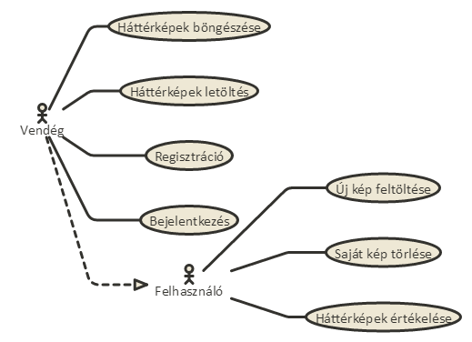

Egy egyszerű példa bemutatása:

A felhasználó ellátogat az oldalra, ahova már korábban beregisztrált. Bejelentkezik majd úgy dönt,hogy megosztani kívánja egy háttérképét. Az ellenőrzés után megjelenik az oldalon a kép. Amennyiben a kép nem felel meg az elvárásoknak elutasításra kerül a közzététel melyről értesítést kap a feltöltő.
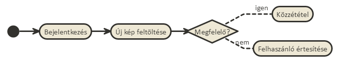

#### 2. Tervezés

##### 2.1 Architektúra terv

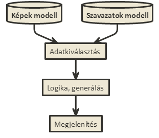

##### 2.2 Oldaltérkép

###### Publikus
* Főoldal
* Bejelentkezés
* Regisztráció
* böngészése

###### bejelentkezett
* Új kép feltöltése
* Kép(ek) értékelés
* Saját kép(ek) törlése

##### 2.3 Végpontok

* GET/: Főoldal

* GET/picture/name: Kép megtekintése
* GET/category/id: Kategórián belül minden kép megtekintése
* GET/uploads: Felhasználó által feltöltött képek
* GET/picture/name/upvote: Kép pozitív értékelése
* GET/picture/name/downvote: Kép negatív értékelése
* GET/upload: Kép feltöltése
* POST/upload: Kép adatainak felküldése
* GET/picture/name/delete: Kép törlése
* GET/register: Regisztráció
* POST/register: Regisztrációhoz szükséges adatok felküldése
* GET/login: Bejelentkezés
* POST/login: Bejelentkezéshez szükséges adatok felküldése
* GET/logout: Kijelenetkezés

##### 2.4 Design

Főoldal

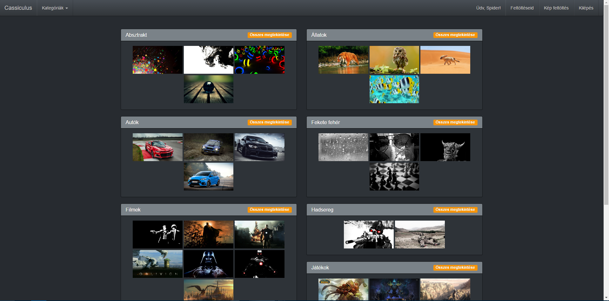

Regisztráció

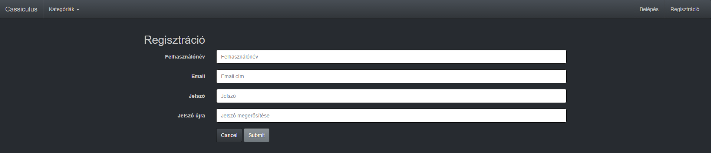

Bejelentkezés

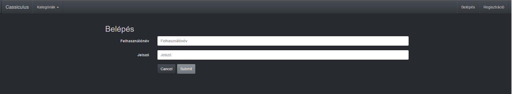

Új kép feltöltése

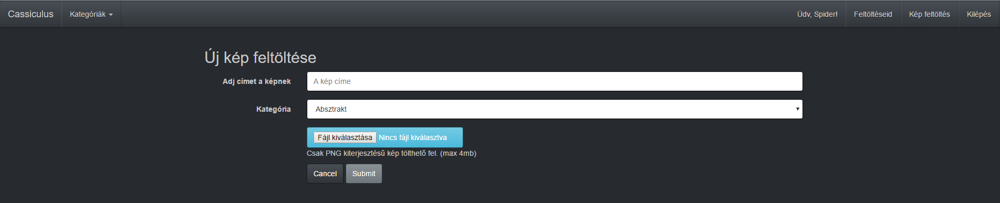

Saját képek

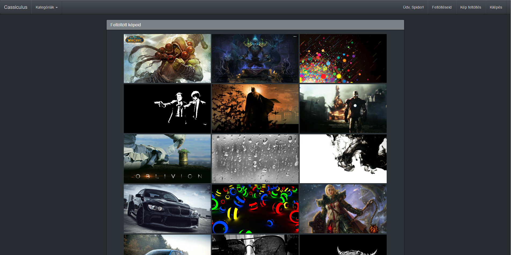

Kategória nézet

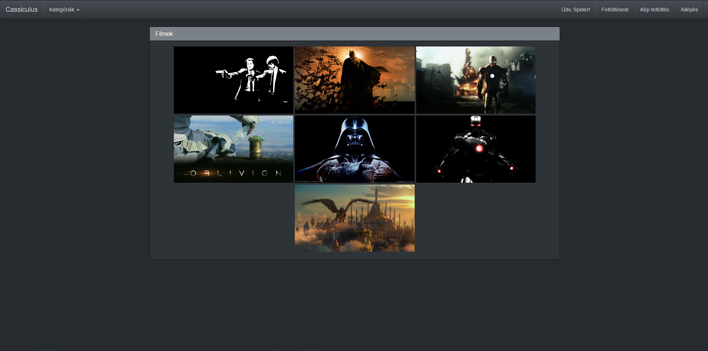

Kép megtekintése/értékelése/törlése/letöltése

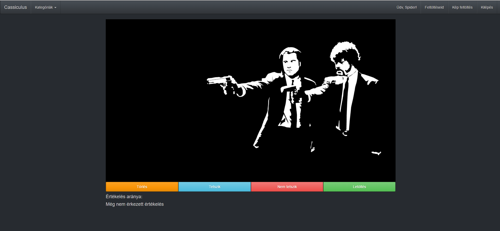

##### 2.5 Adatbázis-modell

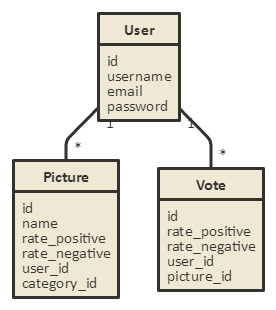

##### Changes

Client JS and Ajax functions:

Index.njk:
* On index page there is a counter on panel-headings. It is counting images in each category
* Also the user can show/hide picture lists under panel-headings. (reminder: by default it shows 9 pictures in each category)

Upload.njk
* Placed a new validator for input elements including file upload button too (this can be find in a different JS file - fileupload.js -)

Login.njk
* Placed a new validator for input elements

Register.njk
* Placed a new validator for input elements

showPicture.njk
* AJAX method for deleting the image
* On progress: AJAX method for vote handling

##### Patch Notes

2016.12.15
Fixed many bug on showPicture.njk:
* from now on guest users can see pictures
* Vote buttons works correctly
* Placed an information text for guests about the vote system

