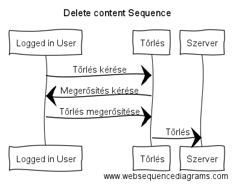

# Dokumentáció

### Kardos Gergő
___

#### 1. Követelményanalízis
##### 1.1 Célkitűzés
Az oldal célja egy olyan rendszer megvalósítása, melyen háttérképek böngészése, 
letöltése, értékelése valamint feltöltése lenne elérhető.
A háttérképek kategóriákra bontva jelennének meg, melyek között szabadon lehet böngészni továbbá a letöltés is lehetséges.
Az értékeléshez a felhasználónak regisztrálnia kell az oldalon valamint minden képet csak egyszer lehessen értékelni.
A feltöltés szintén regisztrációhoz kötött, továbbá ellenőrzöttnek kell lennie, hogy például biztosan a megfelelő kategóriába kerüljön és megfeleljen az általános direktíváknak.  

###### Funkcionális Követelmények
* Regisztráció
* Bejelentkezés
* Letöltés
* Csak bejelentkezett felhasználónak elérhető
    - Új kép feltöltése
    - Saját kép törlése
    - Értékelés

###### Nem funkcionális Követelmények
* **Könnyű kezelés** - áttekinthetőség - kategóriánkénti csoportosítás - rendezési lehetőség 
* **Megbízhatóság** - jelszóval védett tartalom - a jelszavak biztonságos kezelése - hibás adatok esetén érthető figyelmeztetés
* **Karbantarthatóság** - logikus mappa szerkezet a későbbi bővítésre esetleges szűkítésre
* **Teljesítmény** - az előnézeti képek jól megvalósítása, a gyorsabb működéshez

##### 1.2 Szakterületi fogalomjegyzék

**Háttérkép**: olyan kép, fotó, melyeket a képernyő (kijelző) háttereként szoktunk használni.

**Előnézeti kép**: ebben az esetben az eredeti kép kicsinyített változata a jobb átláthatóság és gyorsabb működés érdekében.

##### 1.3 Szerepkörök
**Vendég**: háttérképek keresését, az oldal publikus részét szabad böngészését, háttérképek letöltését végezheti

**Felhasználó**: a *Vendég* szerepkörön túl lehetősége van a saját háttérképeinek megosztására (feltöltés), törlésére, az oldalon levő (nem saját) háttérképek értékelésére

##### 1.4 Használatieset-modell

Egy egyszerű példa bemutatása:

A felhasználó ellátogat az oldalra, ahova már korábban beregisztrált. Bejelentkezik majd úgy dönt,hogy megosztani kívánja egy háttérképét. Az ellenőrzés után megjelenik az oldalon a kép. Amennyiben a kép nem felel meg az elvárásoknak elutasításra kerül a közzététel melyről értesítést kap a feltöltő.

#### 2. Tervezés

##### 2.1 Architektúra terv

##### 2.2 Oldaltérkép

###### Publikus
* Főoldal
* Bejelentkezés
* Regisztráció
* böngészése

###### bejelentkezett
* Új kép feltöltése
* Kép(ek) értékelés
* Saját kép(ek) törlése

##### 2.3 Végpontok

* GET/: Főoldal

* GET/picture/name: Kép megtekintése
* GET/category/id: Kategórián belül minden kép megtekintése
* GET/uploads: Felhasználó által feltöltött képek
* GET/picture/name/upvote: Kép pozitív értékelése
* GET/picture/name/downvote: Kép negatív értékelése
* GET/upload: Kép feltöltése
* POST/upload: Kép adatainak felküldése
* GET/picture/name/delete: Kép törlése
* GET/register: Regisztráció
* POST/register: Regisztrációhoz szükséges adatok felküldése
* GET/login: Bejelentkezés
* POST/login: Bejelentkezéshez szükséges adatok felküldése
* GET/logout: Kijelenetkezés

##### 2.4 Design

Főoldal

Regisztráció

Bejelentkezés

Új kép feltöltése

Saját képek

Kategória nézet

Kép megtekintése/értékelése/törlése/letöltése

##### 2.5 Adatbázis-modell

#### 3. Kliens oldali változások

##### 3.1 Érintett fájlok

* layout.njk
    - popuplogin.js
* index.njk
    - index.js
* upload.njk
    - fileupload.js
* login.njk
* showPicture.njk
    - delete.js
    - vote.js

(Szerver)
* PictureController.js
* UserController.js
* route.js

##### 3.2 Funkciók leírása

* layout.njk
    - popuplogin.js
    
    A layout fájlban elhelyezésre került egy popup ablakért felelős script, lehetőséget adva a felhaszánlónak
    abban,hogy az oldal bármely részén könnyített bejelentkezést biztosítsunk
    
    Ez továbbá egy AJAX funkció is így nincs kellemetlen oldal újra töltődés, sem átírányítás, így akár a már megkeresett kép oldalán maradhat mindvégig úgy,hogy közben bejelentkezhet

* index.njk
    - index.js

    Ezzel a scripttel a képeket tartalmazó dobozokat kattintással össze lehet csukni illetve ki lehet nyitni, valamint a kategória név mellett látható,hogy összesen hány képet tartalmaz az adott kategória

* upload.njk
    - fileupload.js

    A kép feltöltés oldalon levő validáció kiegészítése

* login.njk

    Kikapcsolt javascript esetén ez az oldal töltődik be bejelentkezés esetén.
    Az oldalon beépített kliens oldali validáció van

* showPicture.njk
    - delete.js
    
    AJAX funkció a kép törlésére, amely lehetőséget biztosít a törlés indításának a megerősítésére is
    
    - vote.js

    AJAX funkció a szavazáshoz, a teljes oldal újra töltődést elkerülvén. A háttérben felküldi a kiválasztott szavazatot (tetszik/nem tetszik) a szervernek amely feldolgozza azt, majd a feldolgozás után a kép alatt látható progress-bart frissíti, valamint a gombokat is (ha már szavazott, ugyanazzal az értékkel ne szavazhasson mégegyszer)

    Az oldalolról általánosságban elmondható,hogy hogy bizonyos funkciók csak akkor érhetőek el ha a felhasználónak jogosultsága van hozzá

* PictureController.js
* UserController.js
* route.js 

AJAX funkciókkal bővítésre kerültek

##### 3.3 Törlés szekvencia diagrammja

#### 4. Tesztelés

A teszt fájlok megtalálhatóak a *tests* mappában
Alapvtő funkciók tesztelése található meg bennük amit a Selenium, firefox bővítménnyel valósítottunk meg.
Ez a bővítmény azonban külső források szerint nem kezeli a fájl fel- letöltéseket így ezen funkciók tesztelése nem került megvalósításra ebben a környezetben

#### 4.1 Tesztesetek
* Bejelentkezés
* Saját feltöltött képek megtekintése
* Kép megtekintése
* Egy kategória alá tartozó összes kép megtekintése

#### 5. Felhasználói Dokumentáció

##### 5.1 A futtatáshoz ajánlott hardver-, szoftver konfiguráció
* Intel i7 6900K
* Nvidia Geforce GTX 1080
* 16 Gb RAM
* Billentyűzet/Egér
* Aktív internetkapcsolat
* Megjelenítésre alkalmas eszköz

* Naprakész böngésző valamelyike: Chrome/Edge/Firefox/Opera

##### 5.2 Telepítés

A githubról a git clone paranccsal lehet letölteni a kódot.
A futtatáshoz szükséges egy keretrendszer telepítése is (adonis js) a megfelelő kiegészítő modulok letöltésével együtt

##### 5.3 A program használata

1. Böngészőben nyissuk meg a főoldalt
2. Regisztráljunk a jobb felső sarokban található *Regisztráció* gombra kattintva
3. Bejelentkezni a jobb felső sarokban található *Belépés* gombra kattintva lehetséges
4. Hibás adatok esetén értesítést kapunk
5. *Kép feltöltés* gombra kattintva új képet tölthetünk felel
6. Töltsük ki az űrlapot (kép neve, kategória, kép megadása)
7. Hiányosság esetén az oldal jelezni fogja a hibát
8. *Feltöltésied* menüpontot választva megtekinthetjük az általunk feltöltött képeket
9. A menü sávon kategóriákra szűrve megtekinthetjük egy adott kategória összes képét
10. Egy képet kiválasztva (katt a képre) Letölthetjük azt, valamint belépett felhasználóként értékelhetjük (Tetszik/Nem tetszik)
11. Bejelentkezve saját képeinket törölhetjük is a rendszerből

#### Changes

Client JS and Ajax functions:

Index.njk:
* On index page there is a counter on panel-headings. It is counting images in each category
* Also the user can show/hide picture lists under panel-headings. (reminder: by default it shows 9 pictures in each category)

Upload.njk
* Placed a new validator for input elements including file upload button too (file upload validation is in a different JS file - fileupload.js -)

Login.njk
* Placed a new validator for input elements

Register.njk
* Placed a new validator for input elements

showPicture.njk
* AJAX method for deleting the image
* AJAX method for vote handling

Overall:
* AJAX method for login via popup field

#### Patch Notes

2016.12.15
Fixed many bug on showPicture.njk:
* from now on guest users can see pictures
* Vote buttons works correctly
* Placed an information text for guests about the vote system

